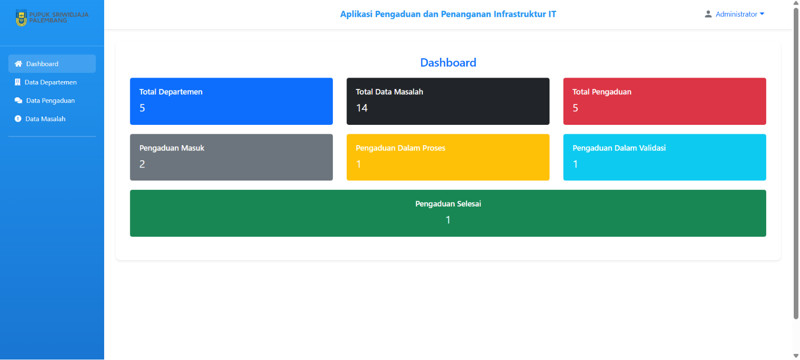
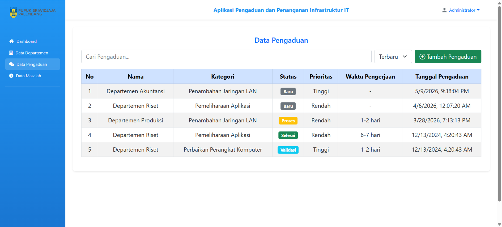
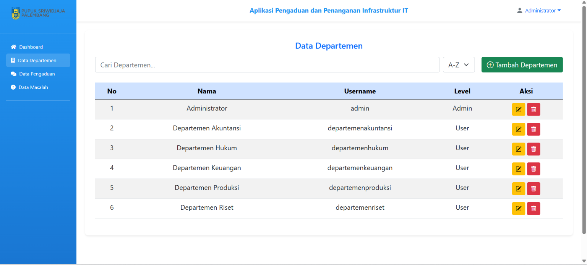
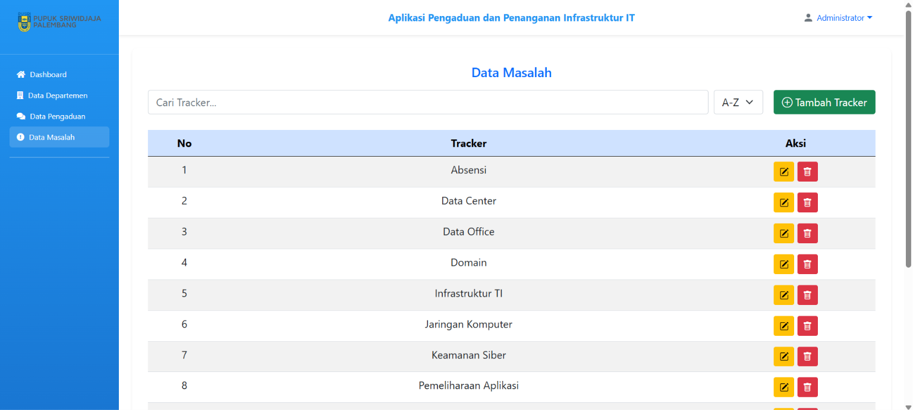

# Aplikasi Pengaduan dan Penanganan Infrastruktur IT

Sistem pengaduan dan penanganan masalah infrastruktur IT berbasis web, dikembangkan saat **Program Magang di PT Pupuk Sriwidjaja Palembang**.

---

## Tentang Aplikasi

Aplikasi ini dibangun untuk memudahkan proses pengaduan dan penanganan masalah infrastruktur IT di lingkungan PT. Pupuk Sriwidjaja Palembang. Setiap departemen dapat melaporkan kendala IT yang dialami, dan admin TI dapat memantau, memproses, serta menyelesaikan pengaduan secara terstruktur melalui antarmuka web.

### Manfaat
1. **Pelaporan Cepat** — Departemen dapat langsung melaporkan kendala IT tanpa harus datang ke ruangan TI, sehingga masalah dapat ditangani lebih awal.
2. **Pemantauan Status** — Admin TI dan user dapat memantau progress penanganan secara real-time melalui alur status bertahap: `Baru → Proses → Validasi → Selesai`.
3. **Dokumentasi Terstruktur** — Seluruh riwayat pengaduan tersimpan dengan rapi, mendukung evaluasi kinerja dan perencanaan infrastruktur IT secara berkelanjutan.

> ⚠️ **Catatan:** Aplikasi ini merupakan **sistem web internal** untuk pengelolaan pengaduan infrastruktur IT. Dikembangkan sebagai bagian dari program Kerja Praktik (Magang) dan dapat dikembangkan lebih lanjut sesuai kebutuhan perusahaan.

---

## Screenshots

### Dashboard


### Data Pengaduan


### Data Departemen


### Data Masalah


---

## Tech Stack

| Teknologi | Keterangan |
|-----------|------------|
| PHP       | Backend & Logic |
| MySQL     | Database |
| Bootstrap 5 | Frontend Framework |
| Font Awesome | Icons |
| Laragon   | Local Server |

---

## Cara Menjalankan

### Prasyarat
Pastikan sudah menginstall **[Laragon](https://laragon.org/download/)** (sudah termasuk Apache, PHP, dan MySQL).

### Langkah-Langkah

**1. Clone Repository**
```bash
git clone https://github.com/AniffXP/Aplikasi-Pengaduan-dan-Penanganan-Infrastruktur-IT.git
```

**2. Pindahkan ke Folder Laragon**

Pindahkan folder hasil clone ke dalam folder `www` milik Laragon:
```
C:\laragon\www\PengaduanIT
```

**3. Start Laragon**

Buka aplikasi Laragon → klik tombol **"Start All"** untuk menyalakan Apache dan MySQL.

**4. Buat Database**

- Buka **phpMyAdmin** di browser: `http://localhost/phpmyadmin`
- Klik **"New"** di sidebar kiri
- Buat database baru dengan nama: **`layanan_pengaduan`**
- Klik **Create**

**5. Import Database**

- Pilih database `layanan_pengaduan` yang baru dibuat
- Klik tab **"Import"**
- Klik **"Choose File"**, pilih file: `database/layanan_pengaduan.sql`
- Klik **"Go"** / **"Import"**

**6. Buka di Browser**

Akses website di browser:
```
http://localhost/PengaduanIT/
```

**7. Login**

Gunakan kredensial berikut:

| Role | Username | Password |
|------|----------|----------|
| Admin | `admin` | `admin` |
| User (Akuntansi) | `departemenakuntansi` | `user` |
| User (Hukum) | `departemenhukum` | `user` |
| User (Keuangan) | `departemenkeuangan` | `user` |
| User (Produksi) | `departemenproduksi` | `user` |
| User (Riset) | `departemenriset` | `user` |

---

## Struktur Folder

```
PengaduanIT/
├── aset/
│   └── style.css             # File styling custom
├── data departemen/
│   ├── deprt.php             # Daftar departemen
│   ├── tambah.php            # Tambah departemen
│   ├── haledit.php           # Edit departemen
│   └── hapus.php             # Hapus departemen
├── data masalah/
│   ├── masalah.php           # Daftar kategori masalah
│   ├── tambah.php            # Tambah tracker
│   ├── haledit.php           # Edit tracker
│   └── hapus.php             # Hapus tracker
├── data pengaduan/
│   ├── pengaduan.php         # Daftar pengaduan (admin)
│   ├── tambah.php            # Tambah pengaduan
│   ├── detail.php            # Detail pengaduan
│   ├── haledit.php           # Edit pengaduan
│   └── hapus.php             # Hapus pengaduan
├── database/
│   └── layanan_pengaduan.sql # File SQL database
├── gambar/                   # Logo & assets
├── login/
│   ├── login.php             # Halaman login
│   └── logout.php            # Proses logout
├── proses/
│   └── login_proses.php      # Proses autentikasi
├── screenshots/              # Screenshot aplikasi
├── uploads/                  # File bukti pengaduan
├── user/
│   ├── dashboard.php         # Dashboard user
│   ├── index.php             # Daftar pengaduan user
│   ├── tambah.php            # Buat pengaduan baru
│   ├── detail.php            # Detail & validasi
│   └── masalah.php           # Lihat kategori masalah
├── index.php                 # Dashboard admin
└── koneksi.php               # Konfigurasi database
```

---

## 👤 Developer

**Abdurrahman Hanif**
- 📧 ahanif562@gmail.com
- 🔗 [GitHub](https://github.com/AniffXP)
- 💬 https://t.me/anonyxpp

---

## 📄 Lisensi

Project ini dibuat untuk keperluan **Laporan Magang (Kerja Praktik)** di PT Pupuk Sriwidjaja Palembang.
